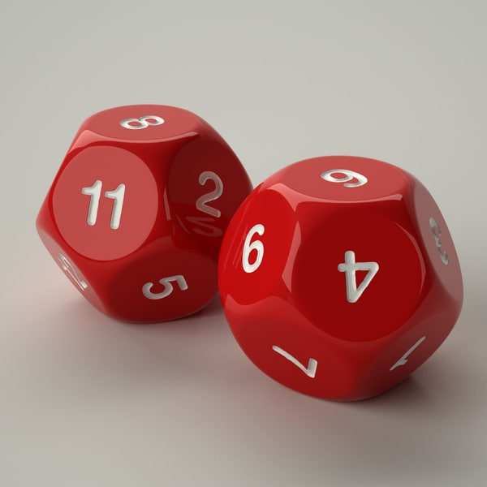

# Introducción {#intro}

Probabilidad es una rama "nueva" de matemáticas (¡tiene menos de 100 años!) que sólo entró a ser considerada como tal después de que Kolmogorov [estableciera sus axiomas en 1933](https://link.springer.com/article/10.1007/BF00348144). Inicialmente (y la aproximación que tomamos aquí es histórica) probabilidad era sólo usada para juegos de azar tomando estimaciones como la siguiente:
$$
\text{Probabilidad de ganar} = \dfrac{\text{Casos favorables}}{\text{Todos los casos posibles}}.
$$
Por ejemplo, en una apuesta por el lado resultante de un tiro de moneda con posibles resultados _cara_ ó _cruz_, al elegir _cruz_ se contempla una probabilidad de ganar de $1/2$ pues los $\text{Casos favorables}$ son sólo uno (que salga _cruz_) y $\text{Todos los casos posibles}$ (descontando cosas raras como que la moneda caiga de lado o que el mundo se acabe antes de que la moneda toque el piso) son dos: caer _cara_ ó _cruz_. Esto lleva al siguiente cálculo de fracciones:

$$
\text{Probabilidad de ganar} = \dfrac{\text{Casos favorables}}{\text{Todos los casos}} = \dfrac{1}{2}
$$
En el caso del tiro de la moneda la aproximación inicial, referente a una moneda _justa_, de $1/2$ de probabilidad de ganar puede no mantenerse siempre. En monedas _reales_ se sabe que no es exactamente $1/2$ la probabilidad ([el relieve sí importa](https://statweb.stanford.edu/~susan/papers/headswithJ.pdf) de forma minúscula además de que [hay gente que puede manipular que una moneda caiga con mayor probabilidad de la manera deseada](https://www.ncbi.nlm.nih.gov/pmc/articles/PMC2789164/)). Podríamos entonces tener el caso de una moneda cargada donde después de arrojarla 100 veces 99 de ellas resultaron en _cara_. Si quisiéramos adivinar el resultado del siguiente tiro (el $101$) no sería tan buena aproximación el contar
$$
\dfrac{\text{Casos favorables}}{\text{Todos los casos}}
$$
pues sigue siendo $1$ caso en el que ganas (que caiga _cara_) de dos casos (que caiga _cara_ o _cruz_). Una mejor aproximación al tiro de la moneda sería (en este caso) contar toda la información de las frecuencias históricas para considerar los $100$ tiros que ya conocemos:
$$
\text{Probabilidad de ganar} =  \dfrac{\text{Casos en los que salió cruz}}{\text{Todos los tiros pasados}} = \dfrac{1}{100}
$$
En este caso de una moneda _cargada_ (es decir que está manipulada para caer más de un lado que de otro) las probabilidades resultan de un conteo de frecuencias pasadas de eventos que ya ocurrieron y no necesariamente resultan en eventos de misma probabilidad (llamados equiprobables). Específicamente en este caso la probabilidad de ganar si elijes cruz es $1/100$ mientras que la de perder es $99/100$. Este es un ejemplo de que **no siempre por tener dos posibilidades la probabilidad de una es $1/2$ y, por supuesto que, de manera general, no por tener $n$ probabilidades la probabilidad de una de ellas es $1/n$.**

A la anterior interpretación de la probabilidad que se dedica a contar del histórico cuántos eventos de cada tipo han ocurrido y dividirlo entre los posibles se le conoce como _frecuentista_. Sin embargo dicha interpretación es incompleta. Bajo la idea de  
$$
\dfrac{\text{Casos favorables}}{\text{Todos los casos}}
$$
o bien de 
$$
\dfrac{\text{Veces en las que ha ocurrido lo que me interesa}}{\text{Todos los casos}}
$$
no se pueden plantear probabilidades para eventos futuros. Por ejemplo: ¿cuál es la probabilidad de éxito de un nuevo producto en el mercado? ¿qué candidato es más probable que triunfe en las próximas elecciones? ¿cuál es la probabilidad de que mañana llueva en mi ciudad? Todos estos eventos no pueden modelarse contando el número de veces que ha ocurrido el evento en el pasado ¡porque no son eventos que se repitan! Tampoco tiene mucho sentido modelarlo considerando casos favorables entre casos totales: aunque un producto puede tener éxito o no tenerlo la probabilidad no es 50 y 50 (los mercadólogos se aseguran de ello); en una elección con tres candidatos no ocurre que cada uno tenga 33.33% de probabilidad de ganar (siempre hay unos con mayores posibilidades); si mañana llueve o no depende de muchos factores desde la presión barométrica, el clima histórico de mi ciudad, la temperatura (bien sabes que hay climas más probables que otros^[O eres de Monterrey donde cualquier evento climático puede ocurrir en un abrir y cerrar de ojos.]). Para esto último (ya llegaremos) se requerirá maquinaria más pesada: el invento de un concepto conocido como _variables aleatorias_ y _el teorema de Bayes_ que en conjunto permiten integrar información adicional (como presión barométrica en el caso de la lluvia o datos de productos similares en el caso del mercado) para poder modelar la probabilidad. 

Si la probabilidad no es sólo conteo de eventos (casos favorables y totales) ¿qué es entonces? En esto se abre una discusión eterna. Hay probabilistas que afirman que es una medida de creencias (si yo te digo que hay una probabilidad del 70% de que llueva mañana es porque _creo_ que la lluvia del día de mañana es un evento posible y _elijo_ cuantificar mi creencia con ese número). A estos probabilistas se les conoce como Bayesianos. Por otro lado, otros probabilistas afirman que es una extensión de la lógica. Al enunciado _Mañana va a llover_  no se le puede asignar una categoría de _verdad_ o _falsedad_ el día de hoy. Empero, se puede asignar una probabilidad (en este caso el 70%) que cuantifique qué tan verdadero es un enunciado. De esta forma, la probabilidad extiende la lógica diciendo qué tan cierto es algo con la probabilidad de 0% siendo un evento que es completamente falso y 100% un evento completamente verdadero. 

Yo, Rodrigo, soy partidario de esta última interpretación. Sin embargo, para fines de estas notas, todas las interpretaciones, sean conteos de frecuencia, grados de credibilidad o grados de verdad, van a ser equivalentes y sólo en detalles minúsculos notaremos algunas diferencias interpretativas. 

Por ahora, comenzaremos nuestra aventura por el mundo de la probabilidad analizando la probabilidad clásica: el conteo de cuántos eventos favorables hay sobre el total de eventos posibles. 

> En esta sección estudiaremos: algunos problemas de probabilidad basado en conteos muy simples (equiprobables) y más adelante nos enfocaremos sólo en contar eventos (cuántas formas hay de que ocurra algo). En la siguiente sección utilizaremos estos conteos para comenzar a hablar de probabilidades

## Algunos problemas "simples" de probabilidad

De manera inicial vamos a presentar algunos problemas de probabilidad calculando casos favorables entre totales y realizar los cálculos correspondientes a manera de ejemplo. Más adelante definiremos mejor lo que estamos haciendo

```{block, type = "Ejemplo"}
### Ejemplo 1: Dado de 6 caras

Considera un tiro de un dado de seis caras numeradas del $1$ al $6$. Suponiendo que el dado es _justo_ (es decir, todas las caras son igualmente probables), ¿cuál es la probabilidad de obtener la cara $5$ en dicho tiro?

> ### Solución 1: Dado de 6 caras
El $5$ es una de las seis caras. En este caso los _casos favorables_ son solamente $1$ (que la cara salga $5$) y los totales son $6$ (de seis posibles caras). Entonces la probabilidad es:
$$
\textrm{Probabilidad} = \dfrac{\text{Casos favorables}}{\text{Casos totales}} = \dfrac{1}{6}
$$

```

Para el siguiente ejemplo tomaremos un dado un poco diferente: 

```{r, out.width = '20%', fig.align="center", echo = FALSE}

```

```{block, type = "Ejemplo"}
### Ejemplo 2: Dado de 12 caras

Considera un tiro de un dado de doce caras numeradas del $1$ al $12$ como el de la imagen superior. Suponiendo que el dado es _justo_ (es decir, todas las caras son igualmente probables), ¿cuál es la probabilidad de obtener la cara $5$ en dicho tiro?

> ### Solución 2: Dado de 12 caras
El $5$ es una de las **doce** caras. En este caso los _casos favorables_ son solamente $1$ (que la cara salga $5$) y los totales son $12$ (de doce posibles caras). Entonces la probabilidad es:
$$
\textrm{Probabilidad} = \dfrac{\text{Casos favorables}}{\text{Casos totales}} = \dfrac{1}{12}
$$

```

Del ejemplo anterior notamos que, bajo la aparente misma pregunta: _¿cuál es la probabilidad de obtener un 5 en un dado?_ no necesariamente tenemos la misma respuesta porque el objeto (en este caso el dado) es distinto. De ahí que sea muy importante distinguir de manera clara el universo de posibilidades al que eventualmente llamaremos $\Omega$ (el dado de 6 caras tiene un universo de resultados posibles _distinto_ del de 12 caras). 

> A lo largo de estas notas nosotros usaremos dados de seis caras a menos que se especifique lo contrario

```{block, type = "Ejemplo"}
### Ejemplo 3: Dado de 6 caras, pregunta por par

Volvemos al universo de un tiro de un dado justo de seis caras numeradas del $1$ al $6$ ¿cuál es la probabilidad de que el resultado de dicho tiro de dado sea un número par?

> ### Solución 3: Dado de 6 caras, pregunta por par
Los pares representan tres de las 6 caras: $\{2,4,6\}$ son las posibles caras _pares_ dentro del universo de caras denotado $\Omega = \{1,2,3,4,5,6\}$. En este caso tenemos tres casos favorables de un total de 6 casos por lo que la probabilidad es:
$$
\textrm{Probabilidad} = \dfrac{\text{Casos favorables}}{\text{Casos totales}} = \dfrac{3}{6} = \dfrac{1}{2}
$$

```

Vamos a extender el problema de los dados y expandirlo a tener ahora dos dados. Una forma de representar los tiros posibles de dos dados es mediante una tabla la cual nos servirá para otros ejemplos más adelante.

```{block, type = "Ejemplo"}
### Ejemplo 4: Dos dados de 6 caras

Vamos a considerar dos tiros de dos dados _justos_ de seis caras. Pensemos que los tiros se dan uno tras otro y que el tiro de un dado no afecta el otro; es decir, los tiros son _independientes_ (casos como que uno de los dados chocó con el otro y cambió su resultado o bien que los dados son mágicos y el tiro de uno determina completamente el resultado del otro quedan descartados). En este escenario ¿cuál es la probabilidad de que el primer dado haya resultado en $5$ y el segundo en $2$ ó $3$ (cualquiera de esos)?

> ### Solución 4: Dos dados de 6 caras
Vamos a enumerar todas las opciones posibles de resultados de los dados. Para ello los representaremos como vectores de dos dimensiones como sigue:
$$
(\text{Resultado del dado 1}, \text{Resultado del dado 2}).
$$
Así $(4,6)$ representa que el primer dado obtuvo un $4$ y el segundo un $6$. La siguiente tabla muestra todos los resultados posibles de los dados.

|          |     |       |*Dado 2*|       |       |       |       |
|----------|:---:|-------|:------:|-------|-------|-------|-------|
|          |     | *1*   | *2*    | *3*   | *4*   | *5*   | *6*   |
|          | *1* | (1,1) | (1,2)  | (1,3) | (1,4) | (1,5) | (1,6) |
| *Dado 1* | *2* | (2,1) | (2,2)  | (2,3) | (2,4) | (2,5) | (2,6) |
|          | *3* | (3,1) | (3,2)  | (3,3) | (3,4) | (3,5) | (3,6) |
|          | *4* | (4,1) | (4,2)  | (4,3) | (4,4) | (4,5) | (4,6) |
|          | *5* | (5,1) | (5,2)  | (5,3) | (5,4) | (5,5) | (5,6) |
|          | *6* | (6,1) | (6,2)  | (6,3) | (6,4) | (6,5) | (6,6) |

> De la lista de todos los $36$ posibles resultados sólo el $(5,2)$ y el $(5,3)$ cumplen la característica de que el primero salió en $5$ y además el segundo fue dos o tres. Haciendo el cálculo de casos totales y favorables obtenemos:
$$
\textrm{Probabilidad} = \dfrac{\text{Casos favorables}}{\text{Casos totales}} = \dfrac{2}{36} = \dfrac{1}{18}
$$

```

```{block, type = "Ejercicio"}
### Ejercicio 1: Dos dados de 6 caras

En el mismo caso de tener dos dados de seis caras, resuelve las siguientes preguntas:

a. ¿Cuál es la probabilidad de obtener un número par en el primer dado?
b. ¿Cuál es la probabilidad de obtener un número par en el segundo dado?
c. ¿Cuál es la probabilidad de obtener un número par en el segundo dado pero no en el primero?
d. ¿Cuál es la probabilidad de obtener un número par en el menos uno de los dados?
e. ¿Cuál es la probabilidad de no obtener un número par en ningún dado?

```

Más allá de los dados (y monedas, pronto veremos monedas), uno de los modelos clásicos de los probabilistas es el de tener pelotas de colores en una urna, revolverlas y ver qué sale. Éste es un modelo de juguete pero que resulta bastante bueno para modelar otras cosas que no son pelotas. 

La pregunta a resolver es la siguiente. Se tiene una caja con cinco pelotas de colores rojo 🔴 y azul 🔵. Las pelotas son indistinguibles^[Pelotas distinguibles, por ejemplo, tendrían números distintos o serían de materiales diferentes o con marcas específicas para saber que una azul 🔵 es distinta de la otra 🔵.] entre sí salvo por el color. Se desconoce exactamente la proporción de colores de la caja (es decir no se sabe cuál de las siguientes opciones es: $\{ 🔴, 🔴, 🔴, 🔴, 🔴\}$, $\{ 🔴, 🔴, 🔴, 🔴, 🔵\}$, $\{ 🔴, 🔴, 🔴, 🔵, 🔵\}$, $\{ 🔴, 🔴, 🔵, 🔵, 🔵\}$, $\{ 🔴, 🔵, 🔵, 🔵, 🔵\}$, $\{ 🔵, 🔵, 🔵, 🔵, 🔵\}$) y eso es lo que se desea determinar. Para ello se extrae una bola, se anota que su color fue rojo, 🔴, y se devuelve a la caja. Se extrae otra bola (que, pudo haber sido la misma que la inicial, recuerda que las bolas son indistinguibles y que la anterior se devolvió a la caja), se anota que su color fue rojo 🔴 y se devuelve a la caja. Finalmente en la tercera extracción sale una pelota azul 🔵. Los datos observados entonces son los siguientes $( 🔴, 🔴, 🔵)$. La forma a determinar cuál es la proporción de colores en la caja se hace mediante probabilidad: la idea es ver, bajo cada una de las construcciones posibles de la caja (_i.e._ $\{ 🔴, 🔴, 🔴, 🔴, 🔴\}$, $\{ 🔴, 🔴, 🔴, 🔴, 🔵\}$, $\{ 🔴, 🔴, 🔴, 🔵, 🔵\}$, $\{ 🔴, 🔴, 🔵, 🔵, 🔵\}$, $\{ 🔴, 🔵, 🔵, 🔵, 🔵\}$, $\{ 🔵, 🔵, 🔵, 🔵, 🔵\}$) son más probables los datos observados $( 🔴, 🔴, 🔵)$ y elegir esa caja. Vamos a resolver este problema calculando bajo cada escenario de caja las probabilidades de obtener la combinación observada $( 🔴, 🔴, 🔵)$. 

La pregunta, antes de resolver el problema, es _¿y esto para qué sirve?_ . Si bien los ejercicios de pelotas de colores y cajas son divertidos, estos por sí mismos no llegan muy lejos. Este mismo problema ocurre de manera poblacional cuando nos interesa estimar una proporción. Por ejemplo, en un país hay personas que padecen diabetes 🔴 y sin diabetes 🔵. Se sabe que en el país hay 100 millones de personas. La proporción exacta (dentro del país) es desconocida. Sin embargo podemos hacer una encuesta y obtener una muestra de 100 personas dentro de las cuáles 20 padecieron diabetes y 80 no ($(20 🔴, 80 🔵)$). De aquí, usando el mismo razonamiento que usaremos con la caja de pelotas podemos buscar la combinación de personas con diabetes y sin diabetes en el país donde la combinación de $(20 🔴, 80 🔵)$ es la más probable. 

Este mismo razonamiento puede extenderse. En una encuesta podemos tener más de dos opciones. Por ejemplo, si interesa determinar la cantidad de personas que votarían por el partido rojo 🔴, por el azul 🔵 o por el negro ⚫  el modelo de pelotas en una caja ahora tiene tres tipos de pelota (y si hay $n$ partidos habría $n$ colores). Puede que los colores estén relacionados entre sí (por ejemplo si se entrevista gente en casas es muy probable que si se vive un niño en una casa _a fuerza_ viva un adulto en ella mientras que la relación inversa no funciona: que un adulto habite una casa no determina que viva un niño en la misma). Otros cambios posibles son en el mecanismo de selección. Pudiera ser que las pelotas rojas 🔴 fueran más grandes que las azules 🔵 de tal forma que cuando se extrajeran hubiera mayor probabilidad de tener rojas en la muestra. Esto pasa, por ejemplo, cuando se hacen encuestas de productos. Generalmente sólo aquellas personas que tienen un sentimiento muy fuerte hacia un producto contestan la encuesta. De ahí que haya muchísimas reseñas diciendo que los productos son malísimos o buenísimos y nada intermedio: la gente que reseña algo con 3 estrellas son las pelotas azules que son más difíciles de extraer. Poco a poco veremos otros problemas con pelotas y urnas con sus análogos al mundo real. Por ahora resolvamos el que se especifica más arriba.

```{block, type = "Ejemplo"}
### Ejemplo 5: Muestreo de urna con dos clases, con orden, con reemplazo

Considera una urna con cinco pelotas de colores rojo 🔴 y azul 🔵. Se desconoce la proporción de pelotas en la urna. Las pelotas son indistinguibles entre sí salvo por el color. Se extrae de manera ordenada primero una bola roja y se devuelve a la cajas Luego se extrae una segunda bola roja y se devuelve a la urna. Finalmente se extrae una tercera bola y resulta azul. La combinación ordenada de pelotas extraídas es: $( 🔴, 🔴, 🔵)$. Suponiendo todas las pelotas tienen la misma probabilidad de salir, cuál de las siguientes cajas posibles tiene una mayor probabilidad de generar los datos observados: $\{ 🔴, 🔴, 🔴, 🔴, 🔴\}$, $\{ 🔴, 🔴, 🔴, 🔴, 🔵\}$, $\{ 🔴, 🔴, 🔴, 🔵, 🔵\}$, $\{ 🔴, 🔴, 🔵, 🔵, 🔵\}$, $\{ 🔴, 🔵, 🔵, 🔵, 🔵\}$ ó $\{ 🔵, 🔵, 🔵, 🔵, 🔵\}$. 

> ### Solución 5: Muestreo de urna con dos clases, con orden, con reemplazo
Hay dos combinaciones de posible urna que podemos descartar desde un inicio: la que sólo tiene rojos $\{ 🔴, 🔴, 🔴, 🔴, 🔴\}$ y la que sólo tiene azules $\{ 🔵, 🔵, 🔵, 🔵, 🔵\}$. Esto porque los datos observados nos muestran que obtuvimos tantos rojos como azules. En estas dos descartadas la probabilidad de obtener $( 🔴, 🔴, 🔵)$ es cero. Quedan como cajas posibles: la de cuatro rojas $\{ 🔴, 🔴, 🔴, 🔴, 🔵\}$, la de tres rojas $\{ 🔴, 🔴, 🔴, 🔵, 🔵\}$, la de tres azules $\{ 🔴, 🔴, 🔵, 🔵, 🔵\}$, la de una roja $\{ 🔴, 🔵, 🔵, 🔵, 🔵\}$. Comenzaré mi análisis con la primera que puse: los otros análisis son similares. 
> 
> **Análisis de  $\{ 🔴, 🔴, 🔴, 🔴, 🔵\}$**
> 
> Una de las formas más posibles de enlistar todos los escenarios es con un árbol. 

```

El problema anterior lo resolvimos multiplicando las ramas del árbol de posibilidades que se creó. Esta es una forma de aproximarse al problema que tiene sus limitaciones: podemos generar un árbol para cinco pelotas ¡pero no para 100 millones de habitantes de un país! En el siguiente apartado volveremos para deducir una fórmula que nos permita saber cuántas posibilidades hay sin tener que enumerarlas. Antes de hacer eso, pensemos en una extensión diferente del problema, una donde una vez que se analiza el color de la pelota esta se tire y _no se devuelva a la caja_. Para contrastar esta forma de muestreo con la anterior a esta se le llama _sin reemplazo_ (porque no se reemplaza la bola que extrajiste con una idéntica en el siguiente turno) y el que estudiamos en el apartado anterior se le conoce como _con reemplazo_. 

Un ejemplo de una encuesta con reemplazo es una encuesta sin controles por Internet donde la misma persona puede volver a rellenar la encuesta cuantas veces quiera (muchas veces basta con borrar las _cookies_ del buscador). Por otro lado una encuesta sin reemplazo es aquella donde se bloquea la múltiple respuesta (por ejemplo en encuestas en la calle donde el encuestador se asegura de que sean personas distintas las que están respondiendo). En este caso, alguien que ya respondió no se considera de nuevo para encuestarlo (su pelota ya no se devolvió a la urna) y las probabilidades son distintas como veremos en el siguiente caso:

```{block, type = "Ejemplo"}
### Ejemplo 5: Muestreo de urna con dos clases, con orden, sin reemplazo

Considera una urna con cinco pelotas de colores rojo 🔴 y azul 🔵. Se desconoce la proporción de pelotas en la urna. Las pelotas son indistinguibles entre sí salvo por el color. Se extrae de manera ordenada primero una bola roja y se elimina (no se devuelve a la caja). Luego se extrae una segunda bola roja y se tira (no se devuelve a la urna). Finalmente se extrae una tercera bola y resulta azul. La combinación ordenada de pelotas extraídas es: $( 🔴, 🔴, 🔵)$. Suponiendo todas las pelotas tienen la misma probabilidad de salir, cuál de las siguientes cajas posibles tiene una mayor probabilidad de generar los datos observados: $\{ 🔴, 🔴, 🔴, 🔴, 🔴\}$, $\{ 🔴, 🔴, 🔴, 🔴, 🔵\}$, $\{ 🔴, 🔴, 🔴, 🔵, 🔵\}$, $\{ 🔴, 🔴, 🔵, 🔵, 🔵\}$, $\{ 🔴, 🔵, 🔵, 🔵, 🔵\}$ ó $\{ 🔵, 🔵, 🔵, 🔵, 🔵\}$. 

> ### Solución 5: Muestreo de urna con dos clases, con orden, con reemplazo
Hay dos combinaciones de posible urna que podemos descartar desde un inicio: la que sólo tiene rojos $\{ 🔴, 🔴, 🔴, 🔴, 🔴\}$ y la que sólo tiene azules $\{ 🔵, 🔵, 🔵, 🔵, 🔵\}$. Esto porque los datos observados nos muestran que obtuvimos tantos rojos como azules. En estas dos descartadas la probabilidad de obtener $( 🔴, 🔴, 🔵)$ es cero. Quedan como cajas posibles: la de cuatro rojas $\{ 🔴, 🔴, 🔴, 🔴, 🔵\}$, la de tres rojas $\{ 🔴, 🔴, 🔴, 🔵, 🔵\}$, la de tres azules $\{ 🔴, 🔴, 🔵, 🔵, 🔵\}$, la de una roja $\{ 🔴, 🔵, 🔵, 🔵, 🔵\}$. Comenzaré mi análisis con la primera que puse: los otros análisis son similares. 
> 
> **Análisis de  $\{ 🔴, 🔴, 🔴, 🔴, 🔵\}$**
> 
> Una de las formas más posibles de enlistar todos los escenarios es con un árbol. 

```

Antes de continuar leyendo, realiza el siguiente ejercicio para ver cómo vas. Pon mucha atención a las reglas de extracción pues en éste las rojas no se devuelven a la caja pero las azules sí. 

```{block, type = "Ejercicio"}
### Ejercicio 2: Pelotas y urnas combinando con y sin reemplazo

Se tiene una caja con cinco pelotas entre rojas 🔴 y azules 🔵. Se desconoce la proporción de pelotas en la urna. Las pelotas son indistinguibles entre sí salvo por el color. Una por una se extraen pelotas de la caja bajo la siguiente regla: si sale una pelota roja, se anota el color y ésta **NO** se devuelve a la caja; si sale una pelota azul, se anota el color y ésta **SÍ** se devuelve a la caja. Se realizaron tres extracciones y se obtuvieron (en ese orden), una roja, una azul y otra roja $( 🔴, 🔵, 🔴)$. Determina cuál de las siguientes cajas posibles tiene una mayor probabilidad de generar los datos observados: $\{ 🔴, 🔴, 🔴, 🔴, 🔴\}$, $\{ 🔴, 🔴, 🔴, 🔴, 🔵\}$, $\{ 🔴, 🔴, 🔴, 🔵, 🔵\}$, $\{ 🔴, 🔴, 🔵, 🔵, 🔵\}$, $\{ 🔴, 🔵, 🔵, 🔵, 🔵\}$ ó $\{ 🔵, 🔵, 🔵, 🔵, 🔵\}$. 

```


Una consecuencia importante del ejercicio anterior es que el orden sí importa. En dicho ejemplo obtener $( 🔴, 🔵, 🔴)$ y $( 🔴, 🔴, 🔵)$ tiene probabilidades distintas porque en el segundo turno (según el caso) se eliminó (o no) una bola de la caja (según si salió roja o no). Hay escenarios probabilísticos donde importa no solo cuántas pelotas salieron sino en qué orden fueron saliendo. Esto lo podemos ver con un ejemplo no con pelotas sino con nombres de personas como sigue:

### Ejemplos sencillos de casos favorables entre totales

## Principios de conteo 

### Permutaciones (muestras ordenadas)

### Combinaciones (subpoblaciones)

### Particiones (problemas de ocupación)

### Representación mediante árboles

### Representación mediante puntos y líneas

### Principio de inclusión/exclusión

## Ejercicios resueltos
